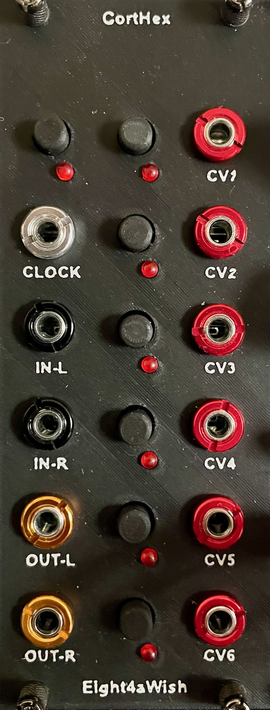
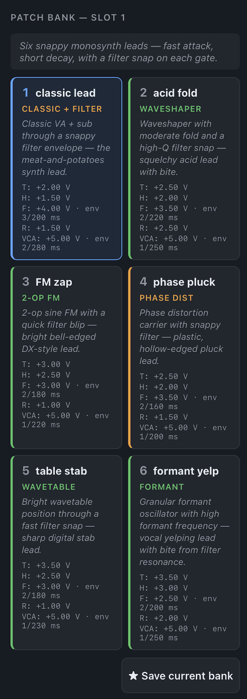
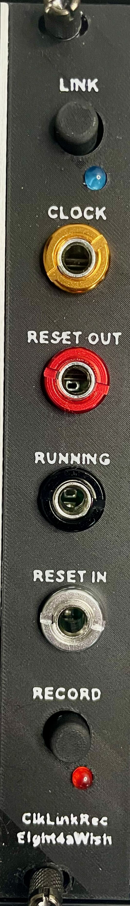
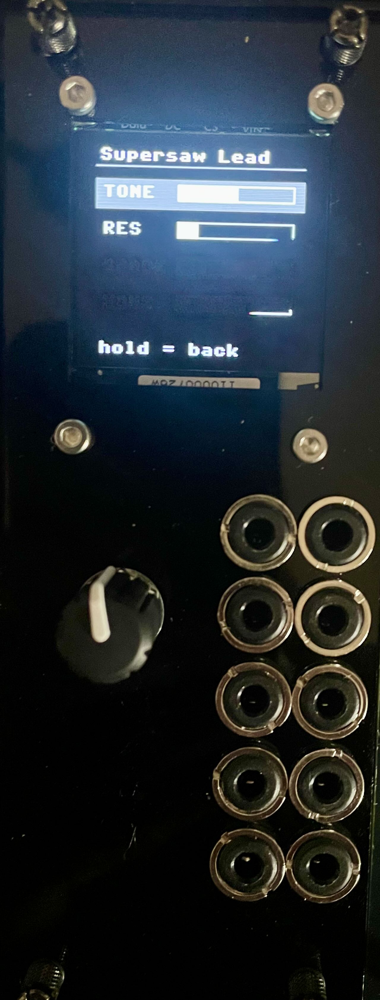
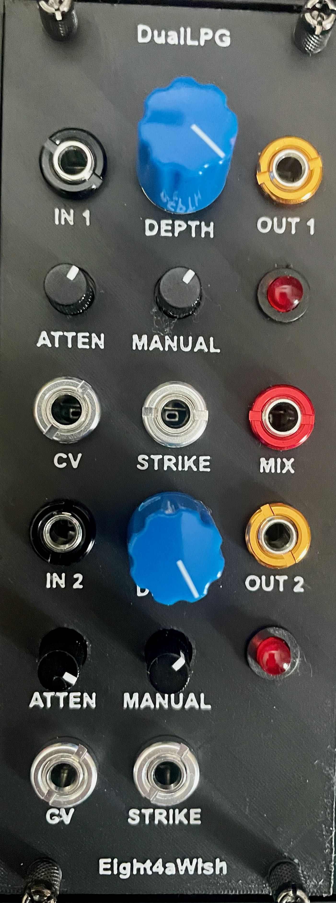
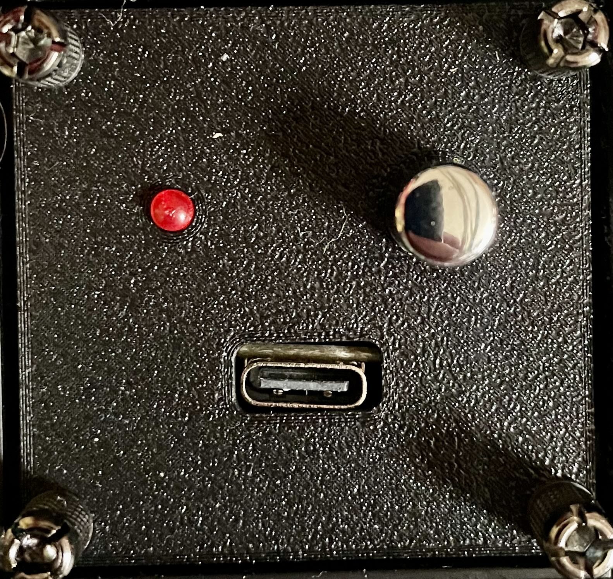
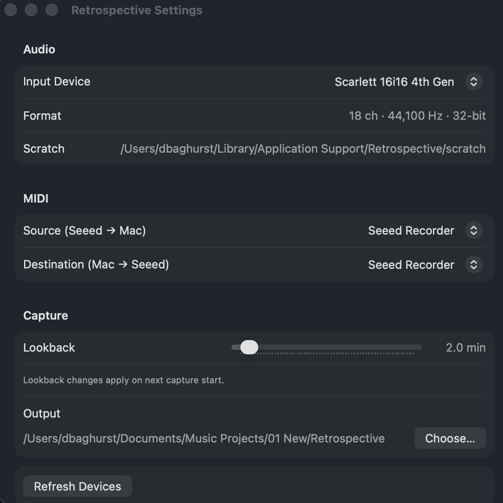

Eight4aWish Eurorack DIY designs including modules based around a range of microcontrollers.

Welcome! This is where I'm documenting my journey with Eurorack modules and other DIY projects.

## Repositories

### [eurorack_modules](https://github.com/Eight4aWish/eurorack_modules)

Hardware and software for Eurorack modules based around Teensy 4.1, Raspberry Pi Pico 2W, Electrosmith Daisy Seed and Ksoloti Core microcontrollers.

  
   
    
  
  
  
  
  

The TeensyMove is designed as a Eurorack interface for the Ableton Move controller featuring four channels of USB midi to CV, 4 channel midi drum triggers, midi clock/reset and audio processing for the Move audio line out. A chord pattern based drone synth is a bonus.

The CortHex is an AI LLM based patch generator with gate in, control button interface and six CV outs to control and modulate VCO, VCF and VCA settings. Natural language user queries via the module web interface lead to the creation of patch banks which can be saved and recalled between sessions. 

The Pico2W OnC Lite is a Raspberry Pi Pico 2W module inspired by some of the apps from the popular Ornament and Crime. It features 4 channels of CV processing and a USB midi to CV interface.

The Daisy Multi FX is a multi effects module based on the Electrosmith Daisy Seed. It features stereo audio processing with a selection of audio effects.

The Ksoloti Elements is a port of the Mutable Instruments Elements module to the Ksoloti Big Genes hardware.  

The ESP32 ClkLink is a Eurorack clock and reset generator that can run standalone or sync to an Ableton Link network on the same WiFi. The ESP32 ClkLinkRec is a variant of the ClkLink that adds a Capture button which fires an HTTP trigger to the Retrospective Mac app over WiFi.

The AMYboard PatchBank is a MicroPython/Tulip app for the shorepine AMYboard (ESP32-S3 + AMY synth engine). Browse curated banks of patches on a 128×128 OLED via rotary encoder, tweak up to four macros per patch across two pages, and play from CV/Gate or TRS MIDI.

### [eurorack_electronics](https://github.com/Eight4aWish/eurorack_electronics)

Analog Eurorack breadboard layouts, drum-voice schematics, and a browser-based layout visualiser. Includes netlists and breadboard layout for a **dual pingable LPG** design built around the canonical Buchla 292 audio path (derived from the NLC, AI017, Aalto/DAFx 2013, Bergmann and Thomas White references).

  

### [eurorack_daisy_patch_init](https://github.com/Eight4aWish/eurorack_daisy_patch_init)

Software for Electrosmith Daisy Patch Init based Eurorack modules including versions of the Mutable Instruments Braids and Grids modules.

  
  
  

Small screens have been added to the Braids and MFX modules to enable easy patch selection and parameter editing. The Grids module features an internal drum sounds mode as well as external trigger and CV/pot adjustments for X, Y, density and chaos. 

### [build123d](https://github.com/Eight4aWish/build123d)

CAD / mechanical work using build123d which includes all the Eurorack faceplate designs as well as Eurorack cable and headphone holder designs.

### [retrospective](https://github.com/Eight4aWish/seeed-recorder)

Seeed Xiao midi based switch connected to a Mac app which listens in and retrospectively captures audio arriving at a chosen soundcard. The Mac app also works with any midi controller but I had a spare 10HP in my 1U rack. The ESP32 ClkLinkRec module (in eurorack_modules) adds a second trigger path over WiFi/HTTP for rigs that aren't tethered to the Mac by USB.

  
  

## Thanks

Huge thanks to [Benjiao Modular](https://benjiaomodular.com) for their fantastic work and inspiration.

## Support

