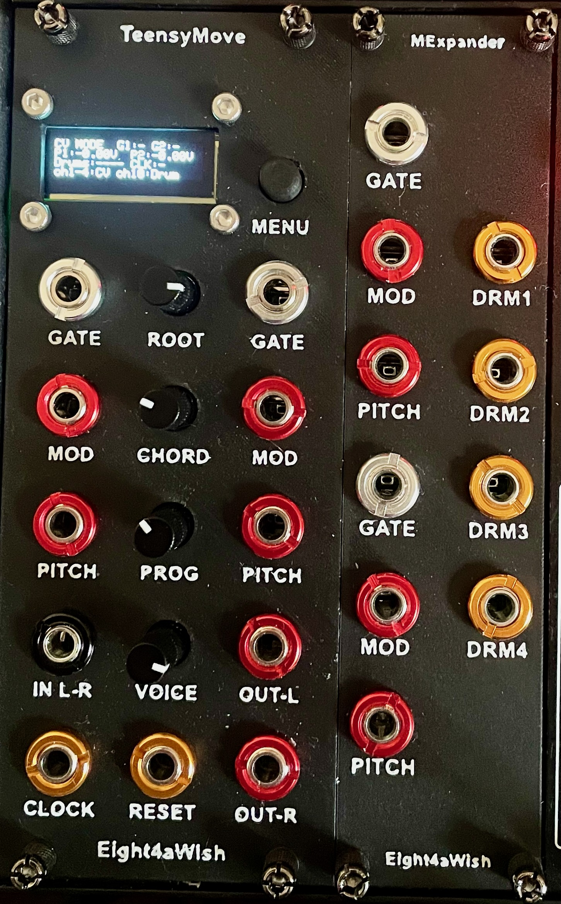
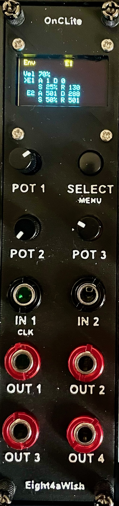
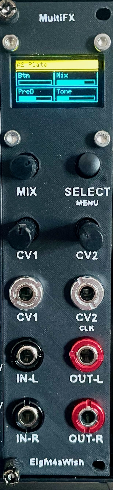
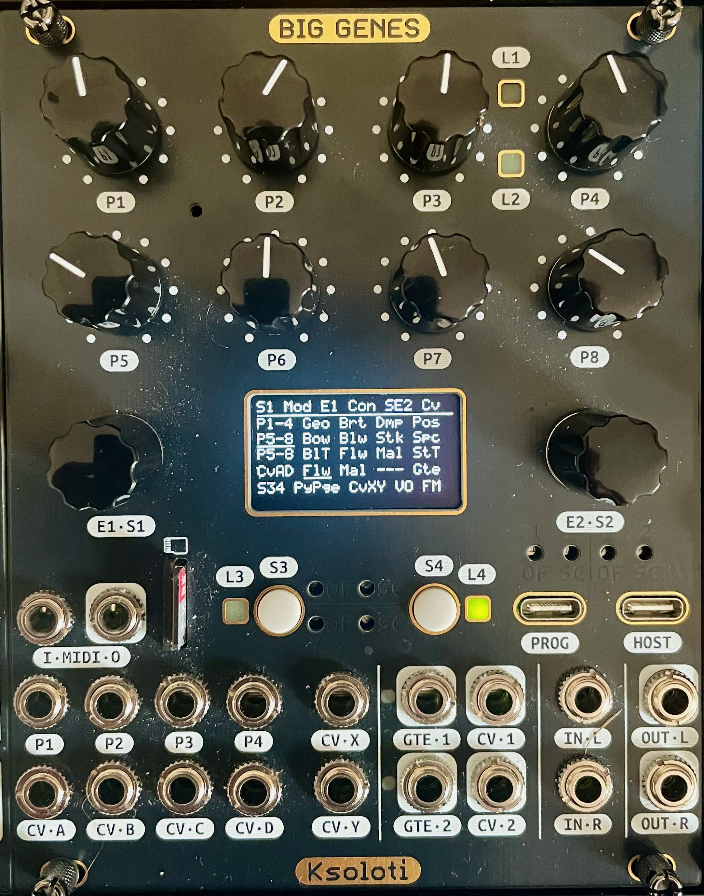
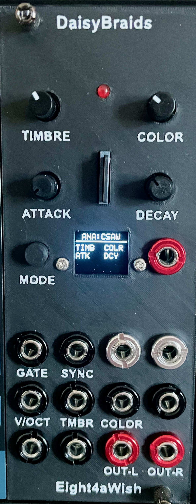
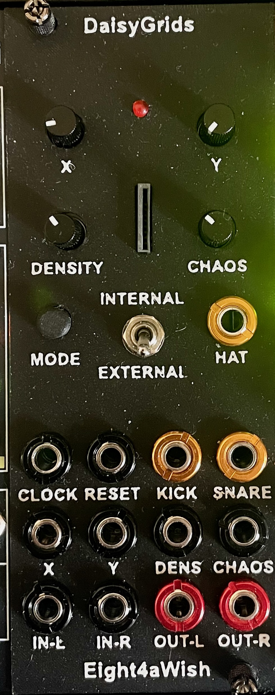
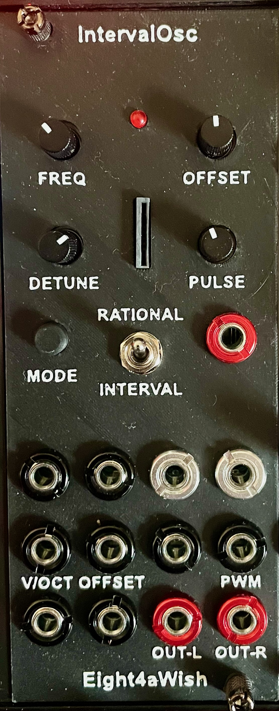
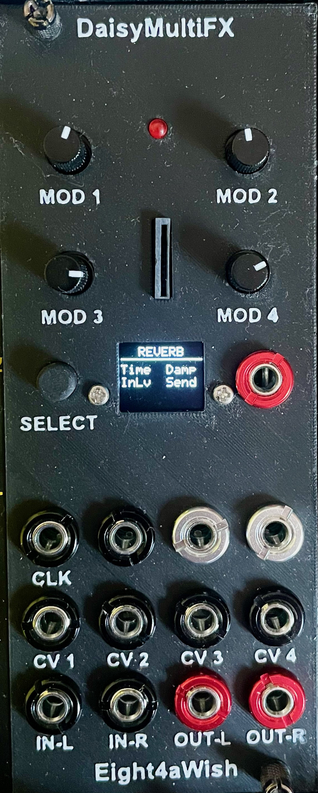

Eight4aWish Eurorack DIY designs including modules based around a range of microcontrollers.

Welcome! This is where I'm documenting my journey with Eurorack modules and other DIY projects.

## Repositories

### [eurorack_modules](https://github.com/Eight4aWish/eurorack_modules)

Hardware and software for Eurorack modules based around Teensy 4.1, Raspberry Pi Pico 2W and Electrosmith Daisy Seed microcontrollers.

  
  
  
  

The TeensyMove is designed as a Eurorack interface for the Ableton Move controller featuring four channels of USB midi to CV, 4 channel midi drum triggers, midi clock/reset and audio processing for the Move audio line out. A chord pattern based drone synth is a bonus.

The Pico2W OnC Lite is a Raspberry Pi Pico 2W module inspired by some of the apps from the popular Ornament and Crime. It features 4 channels of CV processing and a USB midi to CV interface.

The Daisy Multi FX is a multi effects module based on the Electrosmith Daisy Seed. It features stereo audio processing with a selection of audio effects.

The Ksoloti Elements is a port of the Mutable Instruments Elements module to the Ksoloti Big Genes hardware.

### [eurorack_daisy_patch_init](https://github.com/Eight4aWish/eurorack_daisy_patch_init)

Software for Electrosmith Daisy Patch Init based Eurorack modules including versions of the Mutable Instruments Braids and Grids modules.

  
  
  
  

Small screens have been added to the Braids and MFX modules to enable easy patch selection and parameter editing. The Grids module features an internal drum sounds mode as well as external trigger and CV/pot adjustments for X, Y, density and chaos. The IntervalOsc is based on the [IntervalOsc by Nick Donaldson](https://github.com/ndonald2/DaisyPatches/tree/main/patches/IntervalOsc). It sounds great!

### [build123d](https://github.com/Eight4aWish/build123d)

CAD / mechanical work using build123d which includes all the Eurorack faceplate designs as well as Eurorack cable and headphone holder designs.

## Thanks

Huge thanks to [Benjiao Modular](https://benjiaomodular.com) for their fantastic work and inspiration.

## Support

